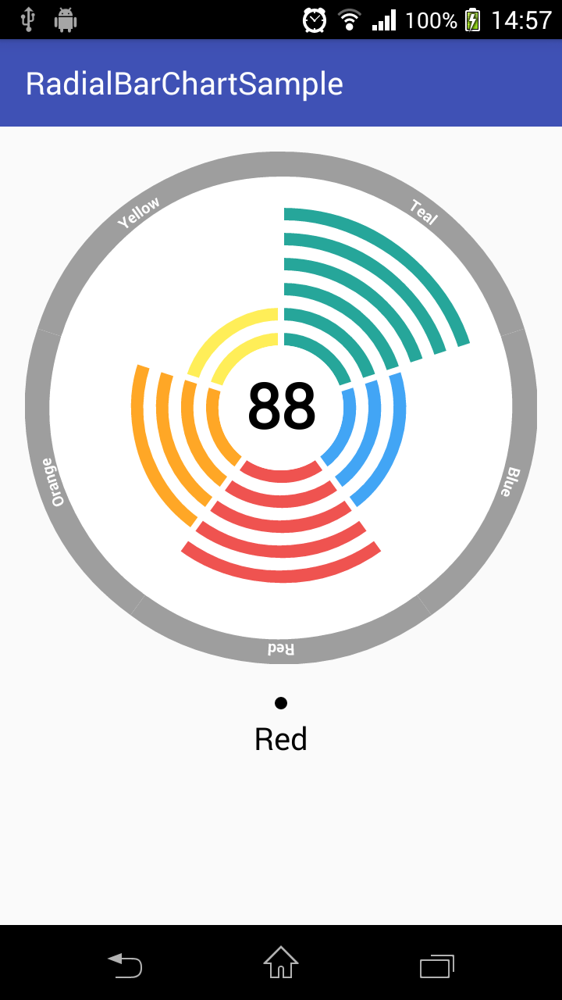

## RadialBarChart for Android

Chart library for Android compatible with API 17: Android 4.2+ (Jelly Bean)

## Screens



## Download and Import

Right now you can clone this sample project and import library as module.

## Usage

Every chart view can be defined in layout xml file:

```xml
    <co.zaven.radialbarchart.charts.RadialBarChartView xmlns:chart="http://schemas.android.com/apk/res-auto"
            android:id="@+id/chart"
            android:layout_width="match_parent"
            android:layout_height="match_parent"
            chart:centerLabelColor="@android:color/black"
            chart:centerLabelHeight="40dp"
            chart:centerLabelText="88"
            chart:centerCircleRadius="20dp"
            chart:pointerLabelColor="@android:color/black"
            chart:pointerLabelHeight="20dp"
            chart:pointerLabelWidth="100dp"
            chart:pointerRadius="4dp"
            chart:rotation="0"
            chart:sliceSpacing="2dp"
            chart:arcSegmentSpacing="4dp"
            chart:arcSegmentStrokeWidth="4dp"
            chart:outerRingWidth="8dp"
            chart:sliceHeaderLabelColor="@android:color/white"
            chart:sliceHeaderLabelHeight="10dp"/>
```

RadialBarChart has its own method to set chart data and its own data model:

```java
   RadialBarChartView radialBarChartView = (RadialBarChartView) findViewById(R.id.chart);
   ArrayList<RadialBarChartModel> data = new ArrayList<>();
   data.add(new RadialBarChartModel("Blue", 45, 2, res.getColor(co.zaven.radialbarchart.R.color.md_blue_400)));
   data.add(new RadialBarChartModel("Red", 75, 2, res.getColor(co.zaven.radialbarchart.R.color.md_red_400)));
   data.add(new RadialBarChartModel("Orange", 55, 2, res.getColor(co.zaven.radialbarchart.R.color.md_orange_400)));
   data.add(new RadialBarChartModel("Yellow", 30, 2, res.getColor(co.zaven.radialbarchart.R.color.md_yellow_400)));
   data.add(new RadialBarChartModel("Teal", 90, 2, res.getColor(co.zaven.radialbarchart.R.color.md_teal_400)));
   radialBarChartView.setData(data);
```

After the chart data has been set you can still modify its attributes but right after that you should call `setData()` method again to let chart recalculate and redraw data.

## Contributing

If you found a bug, have an idea how to improve library or have a question, please create new issue or comment existing one. If you would like to contribute code fork the repository and send a pull request.

#License

	RadialBarChart	
    Copyright 2016 Zaven sp z o.o.

    Licensed under the Apache License, Version 2.0 (the "License");
    you may not use this file except in compliance with the License.
    You may obtain a copy of the License at

       http://www.apache.org/licenses/LICENSE-2.0

    Unless required by applicable law or agreed to in writing, software
    distributed under the License is distributed on an "AS IS" BASIS,
    WITHOUT WARRANTIES OR CONDITIONS OF ANY KIND, either express or implied.
    See the License for the specific language governing permissions and
    limitations under the License.